OpenFOAM is an open source Computation Fluid Dynamics (CFD) solver. It is a C++ toolbox with a large library, allowing for complex models and simulations to be carried out. It also comes with packages to allow parallel computation functionality.

The goal of this project was to learn how to use OpenFoam and ParaView. Two external incompressible 3D flow CFD analyzes based on two different models were performed on a laptop with the following parameters:				

● Processor: Intel i7 4800qm 8x3.70 Ghz 4R/8W

● RAM: 32GB 														

● Graphics Card: nVidia Quadro k5100m 8GB

Both analyzes were carried out on a docker prepared by Konrad Malik:
https://github.com/konradmalik/openfoam211-docker

Parallel calculations were performed on 4 processors and took less than 15 minutes.

The most interesting parameters for me were velocity [m/s] and kinematic pressure [m^2/s^-2] and they are shown on screenshots. All calculations were made on the simpleFoam solver and then visualized in ParaView which supports OpenFoam. An interesting trick that allows you to easily simulate a moving object at speed X is to immobilize it and set speed X as the initial condition for the speed of fluid.

## The first simulation

The first simulation of submarine was based on a Libre Mechanics tutorial, which can be found on their site.
The external flow CFD analysis are commonly used to study the behavior of objects submerged in fluids, it aims to determine how efficiently a body can move throw the medium and how they affect each other in the process.
Here the fluid it's no confined between wall type conditions such as pipes or confined flow cases, the fluid its free to move around the object and interact only with its external "wet" layer, this means that there is the flow involving the body shape what must be analyzed not the core.

Submarine Model dimensions: 
● Lenght : 70m 
● Width: 20m 
● hight: 20m 

It has been meshed in the free "Gmsh" program that supports the mesh implementation into OpenFoam with function "gmshToFoam MeshName"

The first value tested will be 5.14 m/s (10 knots) and second will be 2.14 m/s (~4 knots). No additional forces, velocity’s, or pressure points will be configured over the model, the only goal of the case it’s to determine the flow path over the submarine surface. 

### Results of 1 case (5.14 m/s)

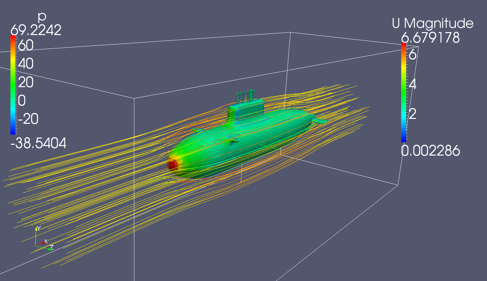

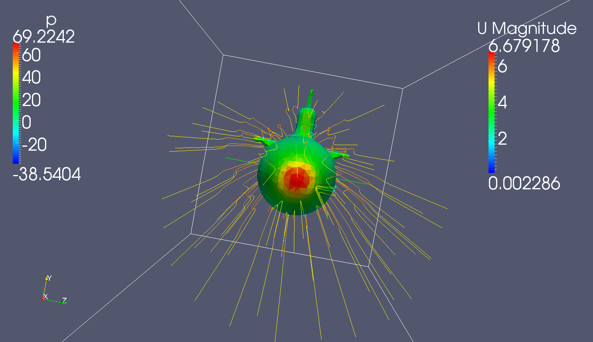

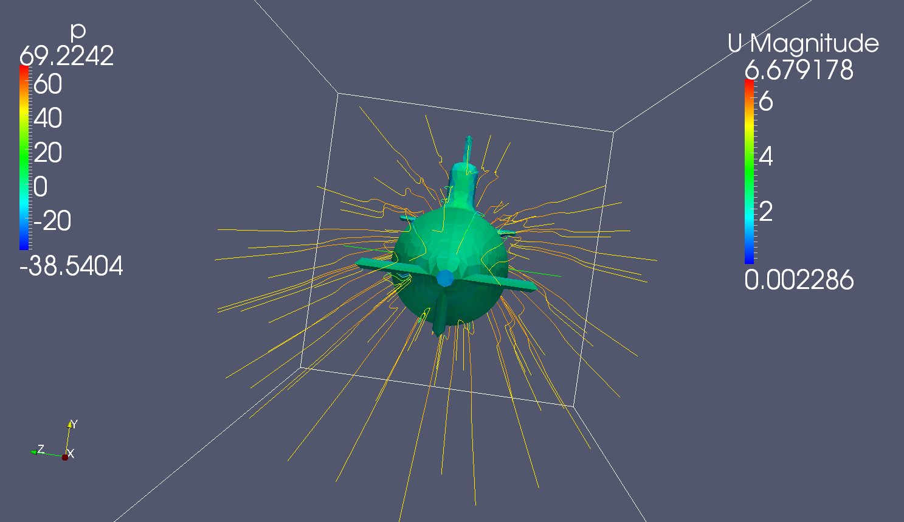

### Results of 2 case (2.14 m/s):

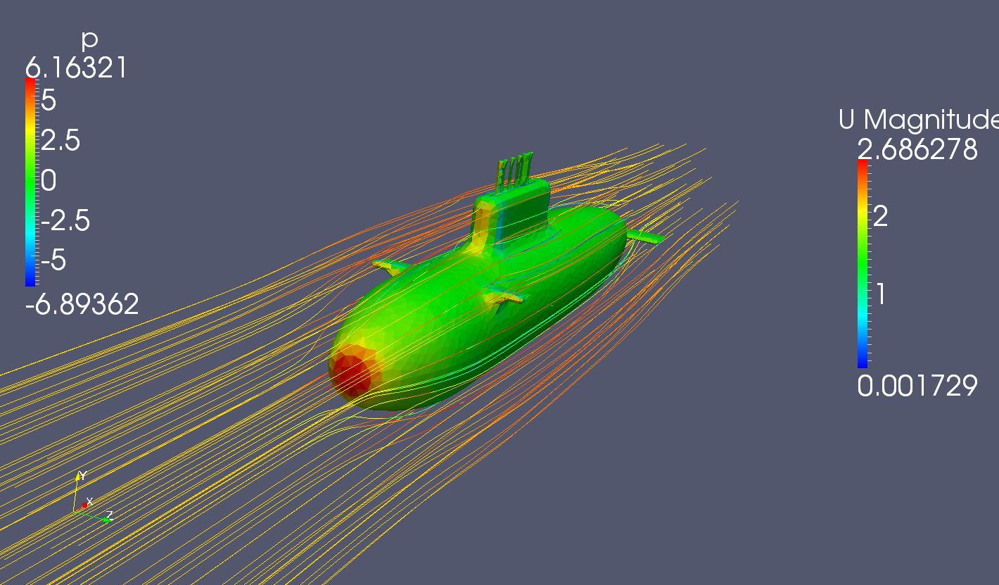

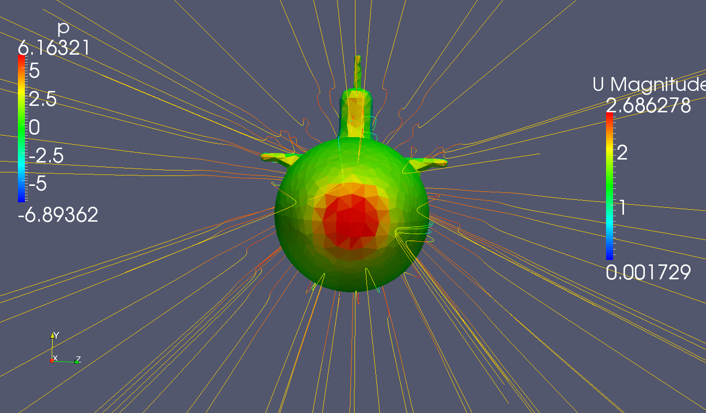

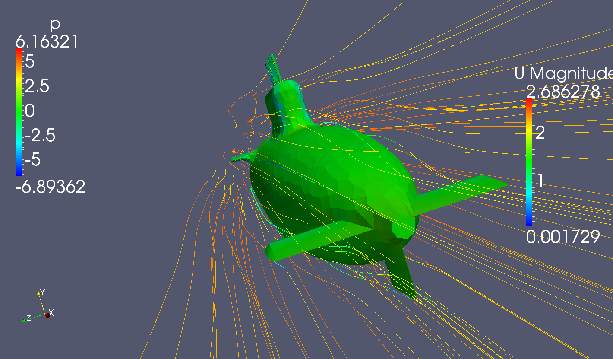

## The second simulation

The second simulation was based on a MotorBike tutorial, which can be found on the OpenFoam website.
As in the previous case it aims to determine how efficiently a body can move throw the medium.

In tutorial we can find the function SnappyHexMesh which properly meshes the object and increases the number of elements at the edges.

In the first case the motor travels at a speed of 20m/s ( 72km/h) and in the second 40m/s ( 144km/h)

### Results of 1 case ( 20m/s ):
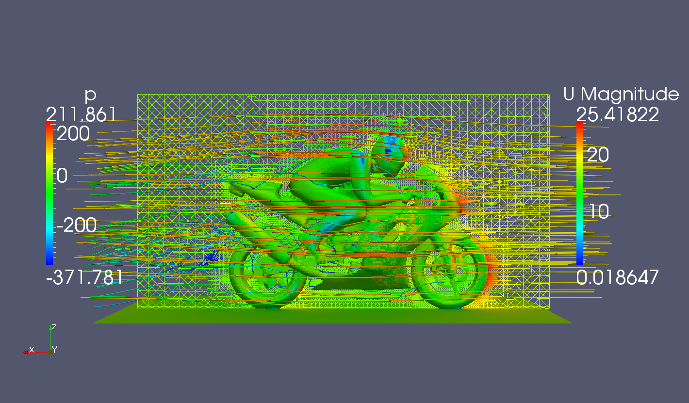

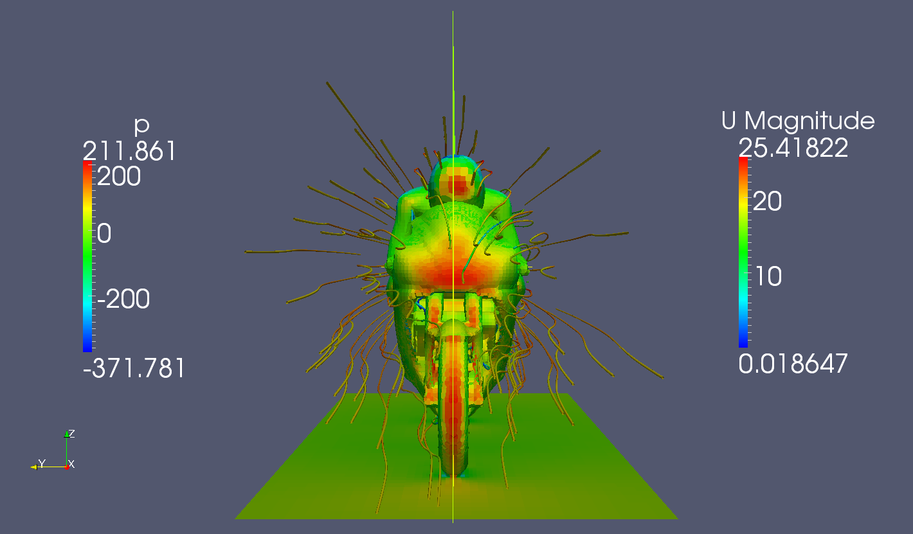

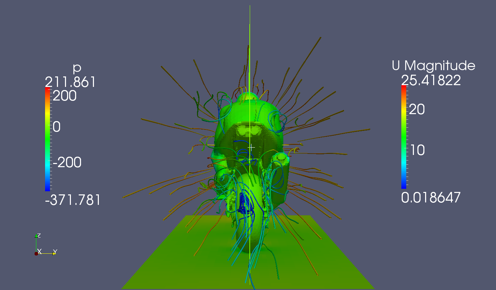
### Results of 2 case ( 40m/s ):

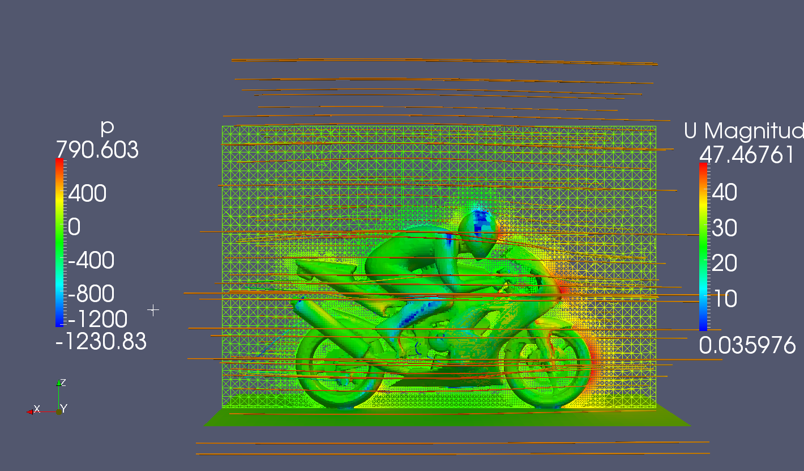

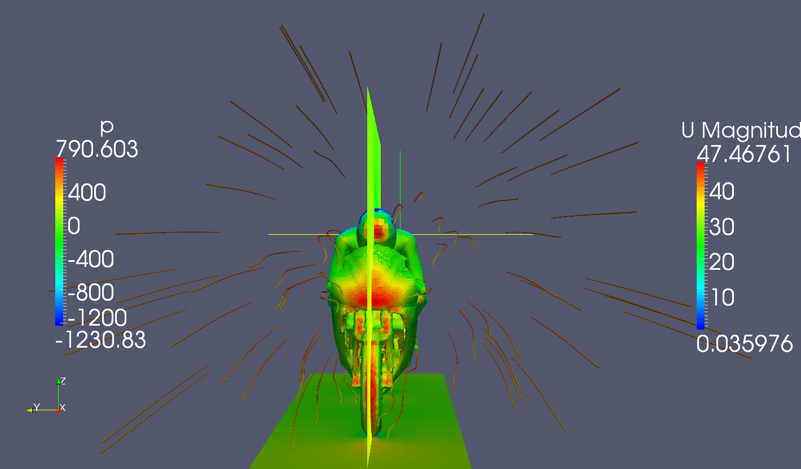

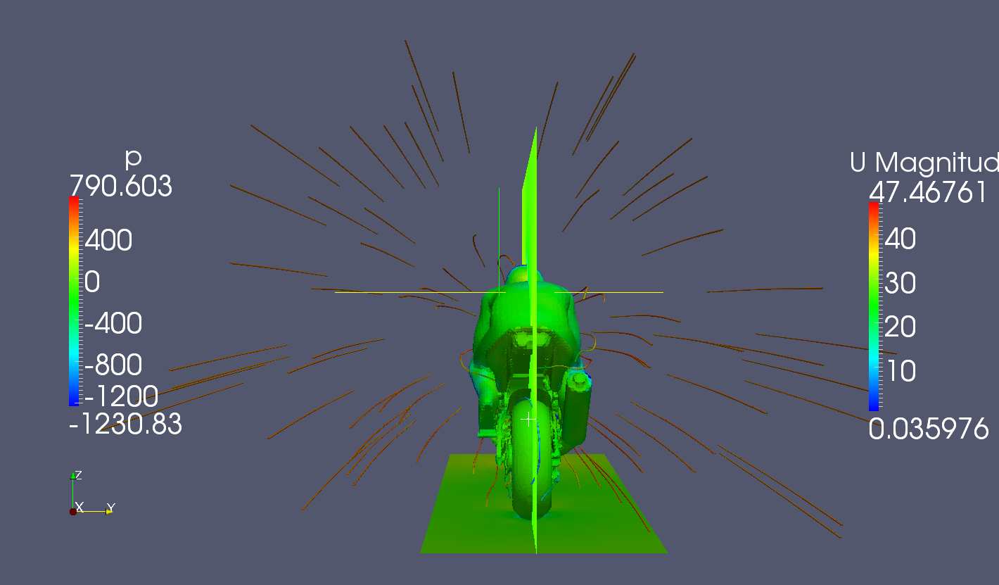

### Conclusion

The most interesting thing to look out for is the image with the back of the motorbike. There is a clear difference in the behavior of the medium between first and second case.

In each image you can see that the object is clearly divided into finite elements, but nevertheless it can be assumed that the results overlap with reality to some extent. To get a smaller error, you would need to increase the number of elements, but this would increase the calculation time. In the first simulation, this problem could be solved by dividing the test object in half due to the presence of the symmetry plane. Unfortunately, the second object is not 100% symmetrical, e.g. because of the exhaust pipe. However, we usually want to look into the front of the motorbike, so this trick can also be used here.
